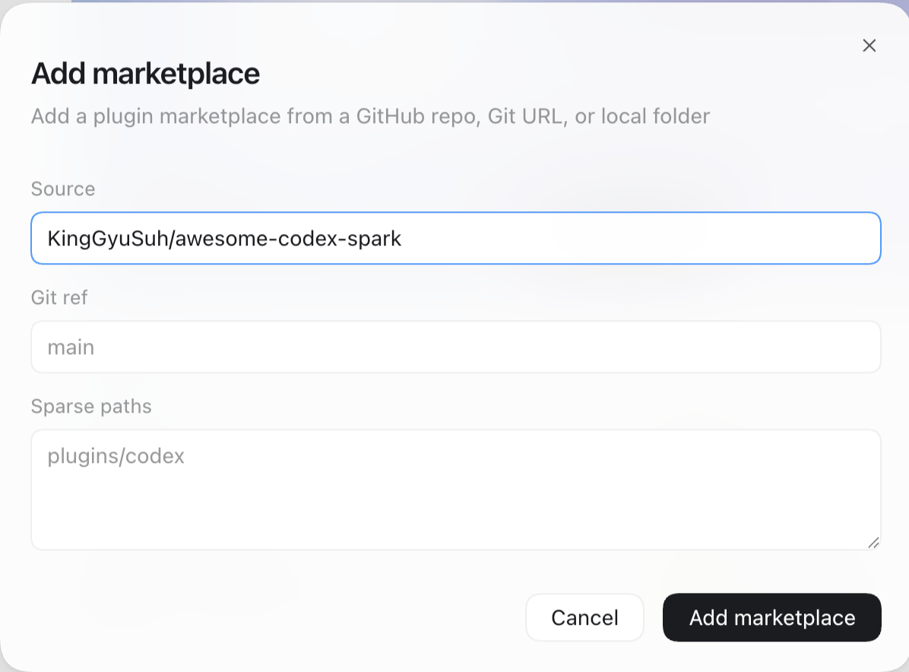
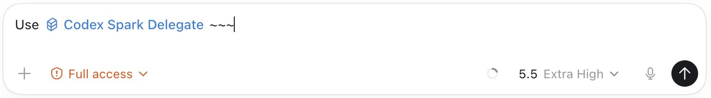

# Codex Spark

[](https://github.com/KingGyuSuh/awesome-codex-spark/actions/workflows/test.yml)
[](LICENSE)
[](https://nodejs.org)
[](https://developers.openai.com/codex)

Codex plugin for delegating concrete Computer Use and Browser Use tasks to GPT-5.3 Codex Spark subagents with structured handoffs and auditable traces.

The plugin packages one main-session skill, **`$codex-spark-delegate`**. The parent session keeps scope, approval, model effort, and recovery; a spark subagent runs one bounded UI/browser task as the executor and returns an auditable trace.

**Quick install:**

```bash
codex plugin marketplace add KingGyuSuh/awesome-codex-spark
```

Then `/plugins` → install `codex-spark` → restart Codex. See [Install](#install) for tag-pinned, local-clone, and Codex desktop app paths.

**Contents** — [Why](#why) · [What This Is Not](#what-this-is-not) · [What It Installs](#what-it-installs) · [Requirements](#requirements) · [Install](#install) · [Usage](#usage) · [Validation](#validation) · [Troubleshooting](#troubleshooting) · [Development](#development) · [Documentation](#documentation)

## Why

Codex Spark is useful when the main session should not spend its attention on mechanical UI work: opening a page, reading visible state, filling approved form values, clicking through a bounded flow, or checking a local browser surface.

The child agent must return a trace: what it saw, what it did, which checks passed, what artifacts exist, and what the parent should do next. That trace is load-bearing because the parent has to resolve login problems, approval gaps, mismatches, or partial side effects.

## What This Is Not

Intentionally narrow:

- **Not a domain executor** — no built-in X poster, Reddit poster, Gmail sender. Those belong in separate plugins.
- **Not a fallback layer** — does not silently degrade to web search, HTTP, or a headless browser when Browser Use is unavailable.
- **Not a planner** — the spark child does not decide content, accounts, or scope. The parent does.

## What It Installs

The plugin lives under `plugins/codex-spark/` (subdirectory layout per the official Codex docs), with the marketplace at the repo root:

```text
.agents/plugins/marketplace.json                                       # marketplace entry, source.path → ./plugins/codex-spark
plugins/codex-spark/.codex-plugin/plugin.json                          # plugin manifest
plugins/codex-spark/skills/codex-spark-delegate/SKILL.md
plugins/codex-spark/skills/codex-spark-delegate/references/test-prompts.md
plugins/codex-spark/skills/codex-spark-delegate/references/text-entry-guide.md
plugins/codex-spark/skills/codex-spark-delegate/agents/openai.yaml
plugins/codex-spark/assets/logo.svg
plugins/codex-spark/assets/composer-icon.svg
plugins/codex-spark/assets/screenshot-1.svg
```

Codex plugins package skills, app integrations, MCP servers, hooks, and assets. Subagent TOML files remain standalone Codex configuration, so this plugin does not auto-install a static `.codex/agents` file — the skill instructs the parent session to spawn a `default` subagent with the contract below.

| Field | Value |
| --- | --- |
| Model | `gpt-5.3-codex-spark` |
| Reasoning effort | `high` by default; `medium` / `low` only for simpler read-only work |
| Handoff sections | `TASK`, `TRACE_ID`, `TOOL_SURFACE`, `TARGET`, `CONTENT`, `EXECUTION`, `VERIFY`, `LIMITS`, `REPORT` |

## Requirements

| Requirement | Notes |
| --- | --- |
| Codex CLI | `0.128.0` or later, with an active login |
| OS | macOS for Computer Use; Browser Use is cross-platform |
| Model access | `gpt-5.3-codex-spark` in your Codex session. Without it, the subagent returns an `aborted` trace with a `model_unavailable` blocker; falling back to another model works but trace quality reflects that model's executor profile, not Spark's |
| Node.js | `>=18.18`, only for `npm test` and `npm run test:local`. Not required at runtime |

## Install

This repo ships its own in-session marketplace at `.agents/plugins/marketplace.json`, with the plugin tree under `plugins/codex-spark/`. Self-serve publishing on the official Codex plugin marketplace is reported as "coming soon" by the OpenAI docs, but the marketplace file works today through any of the three sources below. Pick one, then `/plugins` → open the `Awesome Codex Spark` entry → install `codex-spark` → restart Codex.

### Public Git Repo (recommended)

GitHub shorthand — no clone, no path management:

```bash
codex plugin marketplace add KingGyuSuh/awesome-codex-spark
codex
/plugins
```

### Pinned Tag

For reproducible installs against a specific release:

```bash
codex plugin marketplace add KingGyuSuh/awesome-codex-spark@<tag>
codex
/plugins
```

### Local Clone

For contributors developing the plugin in-tree, or anyone who wants to install from a checkout:

```bash
git clone https://github.com/KingGyuSuh/awesome-codex-spark.git
cd awesome-codex-spark
codex plugin marketplace add "$PWD"
codex
/plugins
```

### Codex Desktop App

If you use the Codex desktop app instead of the CLI, the marketplace is added through the Plugins UI:

1. Click **Plugins** in the side tab.
2. Open the **Built by OpenAI** dropdown next to the search box and choose **+ Add more**.
3. In the **Add marketplace** dialog, enter `KingGyuSuh/awesome-codex-spark` in the **Source** field (leave **Git ref** and **Sparse paths** at their defaults) and click **Add marketplace**.



Then install `codex-spark` from the plugin tile. Type `$` in the composer — `codex-spark:codex-spark-delegate` should appear in the autocomplete list. If it does not show up, reboot the desktop app once and try again.



Issue the handoff with the namespaced skill name:

```text
Use $codex-spark:codex-spark-delegate ...
```

Once `codex-spark` is installed (CLI or desktop app), invoke from any Codex thread:

```text
Use $codex-spark-delegate to run a read-only Browser Use check on http://localhost:3000.
```

> Note: the CLI accepts the short form `$codex-spark-delegate`; the desktop app's autocomplete uses the namespaced form `$codex-spark:codex-spark-delegate`. Both invoke the same skill.

## Usage

End-to-end recipes live under [`examples/`](examples/):

| Recipe | Surface | What it shows |
| --- | --- | --- |
| [`qa-local-nextjs.md`](examples/qa-local-nextjs.md) | Browser Use | Read-only QA pass on a localhost dev server |
| [`approved-form-submit.md`](examples/approved-form-submit.md) | Browser Use | Approved form fill with explicit parent approval |
| [`korean-clipboard-paste.md`](examples/korean-clipboard-paste.md) | Computer Use | Validated clipboard + `press_key` path for Korean / non-ASCII entry |

A minimal read-only Browser Use handoff:

```text
Use $codex-spark-delegate.
Task: inspect http://localhost:3000/settings and report whether the Save button is enabled.
Tool surface: browser-use.
Limits: read-only, no clicks, one page only.
Verify: return visible URL, button label, enabled/disabled state, and screenshot note if available.
```

A minimal approved Computer Use handoff:

```text
Use $codex-spark-delegate.
Task: paste the exact approved post text into the visible X composer and stop before publishing.
Tool surface: computer-use.
Target: Google Chrome, logged-in X account @example.
Content: "Exact approved text"
Execution: APPROVAL: parent confirmed exact action and content. Stop before final publish click.
Verify: visible composer text exactly matches Content.
```

## Validation

Three levels:

- **Static validators** — manifest, marketplace, skill contract, and production tree shape.
- **External-project `codex exec` maintainer smoke** — checks the installed skill produces the required handoff sections.
- **Manual live checks** — Browser Use blocked-path behavior, Computer Use preflight, a local approved action, and Korean clipboard paste.

Full notes: [`docs/VALIDATION.md`](docs/VALIDATION.md).

## Troubleshooting

**Spark child reports `model_unavailable`.** Your Codex session does not have access to `gpt-5.3-codex-spark`. Either request access or rewrite the handoff to use a model you can spawn — note that trace quality changes accordingly.

**Browser Use surface returns `blocked` immediately.** The Browser Use plugin is not installed in the same Codex session. Install Browser Use, restart, and re-issue. The skill is designed to surface this rather than silently fall back to Computer Use or HTTP.

**Korean / CJK / emoji input becomes garbled.** The executor used `type_text` instead of clipboard + `press_key`. Re-issue the handoff and quote [`text-entry-guide.md`](plugins/codex-spark/skills/codex-spark-delegate/references/text-entry-guide.md) explicitly. The validated path is `pbcopy` → `press_key super+v` → exact-match read.

**Trace says `succeeded` but the side effect did not actually land.** Look for `side_effect_unverified` in the trace next time — it is a documented status. If you saw `succeeded` despite an unconfirmed side effect, the executor skipped the post-action visible read, which is a contract break. File an issue with the trace.

**`/plugins` does not show the plugin tile.** Confirm the `marketplace add` source resolves to a tree that contains `.agents/plugins/marketplace.json`: for the local-clone path, that means running the command from the repo root (not a sibling directory); for the GitHub shorthand path, that means using the `KingGyuSuh/awesome-codex-spark` slug exactly. Restart Codex after install in either case.

## Development

```bash
npm test           # static validators
npm run test:local # external-project codex exec smoke
```

- **`npm test`** runs `validate-plugin`, `validate-skill`, and `validate-production`.
- **`npm run test:local`** creates `/tmp/codex-spark-plugin-test`, stages this repository as a local Codex plugin, writes a local marketplace file, mirrors the exact skill into the external test project for non-interactive ephemeral `codex exec`, and checks that the skill produces the expected structured handoff.

Manual live tests should additionally install the plugin through `/plugins` and run disposable Browser Use or Computer Use tasks from a fresh Codex thread.

## Documentation

- [Architecture](docs/ARCHITECTURE.md)
- [Validation](docs/VALIDATION.md)
- [Contributing](CONTRIBUTING.md)
- [Security](SECURITY.md)
- [Changelog](CHANGELOG.md)
- Manifest schema: [`plugin.schema.json`](plugin.schema.json) (advisory; for editor and CI validation)

Official Codex docs used for this shape:

- [Build plugins](https://developers.openai.com/codex/plugins/build)
- [Agent Skills](https://developers.openai.com/codex/skills)
- [Subagents](https://developers.openai.com/codex/subagents)
- [Use your computer with Codex](https://developers.openai.com/codex/use-cases/use-your-computer-with-codex)

## License

[MIT](LICENSE).
